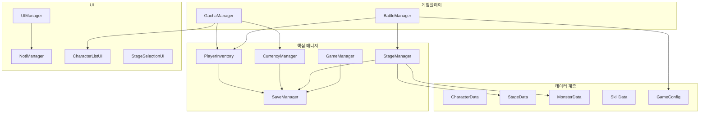
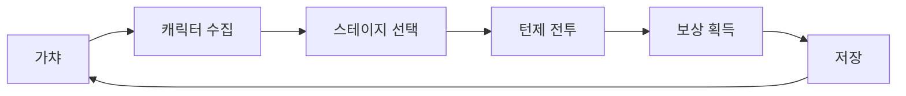

# SummonQuest - Unity 2D RPG

Unity 6000 LTS 기반 2D 수집형 RPG 포트폴리오 프로젝트입니다.  
가챠로 캐릭터를 모으고, 스테이지를 클리어하며, 턴제 전투로 성장하는 게임 루프를 구현했습니다.

## 주요 기능

- **가챠 시스템**: 1연/10연, 등급별 확률, 중복 보상
- **캐릭터 수집/강화**: 레벨업, 스킬, 즐겨찾기, 필터/정렬
- **스테이지**: ScriptableObject 기반 던전, 해금/클리어 진행
- **턴제 전투**: 자동 전투, 스킬/일반 공격, 연속 몬스터/보스, 속성 상성, 상태이상
- **출전 캐릭터 지정**: 보유 캐릭터 중 전투 참여 캐릭터 선택/저장
- **각성 시스템**: 중복 캐릭터 소모로 각성 단계/최대 레벨/공격력 상승
- **저장**: JSON 단일 파일 (`character_save.json`)

## 기술 스택

- Unity 6000.0.52f1 LTS
- C# / ScriptableObject
- DOTween
- TextMeshPro
- Singleton + Manager 패턴

## 시스템 구조



## 클래스 역할

| 클래스 | 역할 |
|--------|------|
| `PlayerInventory` | 보유 캐릭터 데이터, 추가/저장 |
| `GachaManager` | 가챠 뽑기, 결과 연출 |
| `BattleManager` | 턴제 전투, 보상 처리 |
| `StageManager` | 스테이지 로드/진행/해금 |
| `SaveManager` | JSON 저장/로드 통합 |
| `GameConfig` | 가챠 비용, 전투 보상, HP/상성/각성/상태이상 설정 |
| `ElementHelper` | Fire > Wind > Earth > Water > Fire 상성 계산 |
| `NotiManager` | 알림 패널/텍스트 표시 |

## 게임 루프



1. 골드로 가챠 → 캐릭터 획득/중복 보상
2. 스테이지 선택 → 몬스터/보스 연속 전투
3. 승리 시 골드/경험치 → 캐릭터 강화/레벨업
4. `SaveManager`가 진행도 자동 저장

## 저장 구조

`Application.persistentDataPath/character_save.json`

```json
{
  "ownedList": [{ "characterID", "level", "count", "exp", ... }],
  "playerGold": 0,
  "highestClearedStage": -1,
  "stageProgress": [{ "stageIndex", "isCleared", "clearCount" }],
  "totalPlayTime": 0,
  "totalBattles": 0,
  "totalGachaPulls": 0,
  "selectedCharacterId": "Char_1"
}
```

## Resources 구조

```
Assets/Resources/
├── CharacterData/   # 캐릭터 SO
├── StageData/       # 스테이지 SO
├── MonsterData/     # 몬스터 SO
└── GameConfig.asset # 게임 밸런스 설정
```

## 실행 방법

1. Unity 6000.0.52f1 LTS로 프로젝트 열기
2. `Assets/Scenes/Main.unity` 실행
3. 가챠 → 캐릭터 확인 → 스테이지/전투 진행

## 포트폴리오 메모

- ScriptableObject 기반 데이터 주도 설계
- Manager 간 역할 분리 (`PlayerInventory` / `GachaManager` / `SaveManager`)
- JSON 통합 저장으로 진행도 영속성 확보

## 스크린샷 / GIF

> 플레이 영상 또는 스크린샷을 `Docs/` 폴더에 추가하면 포트폴리오 완성도가 올라갑니다.

- [ ] 메인 UI / 가챠 결과
- [ ] 캐릭터 목록 / 상세
- [ ] 스테이지 선택 / 전투
